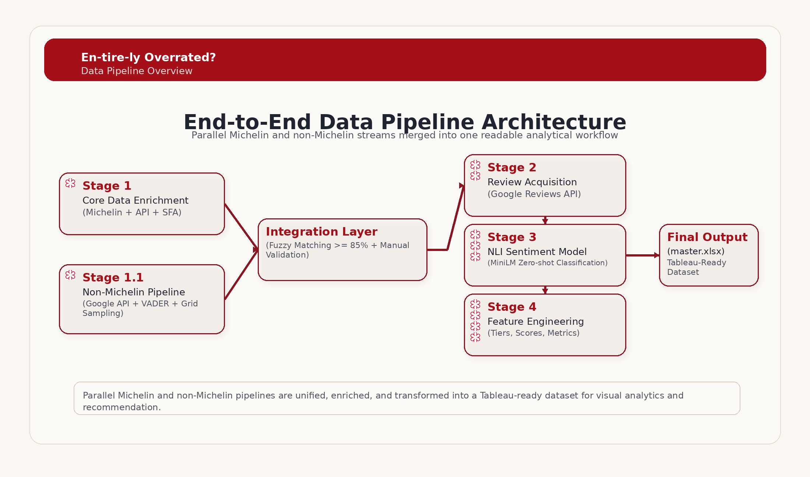

<div align="center">
  

  <h1>🍽️ En-tire-ly Overrated?</h1>
  <p><em>Does Michelin Recognition in Singapore Accurately Reflect Dining Quality?</em></p>

  <p>A data-driven investigation examining whether Michelin stars truly guarantee superior dining experiences — by analyzing customer sentiment, food safety, and value for money.</p>

  <br/>

  
  
  
  
  
  
</div>

---

## 📖 About

- 🌐 **Web App:** [https://entirely-overrated.vercel.app/](https://entirely-overrated.vercel.app/)
- 📊 **Tableau Dashboard:** [https://public.tableau.com/app/profile/swen.teo/viz/En-tire-lyOverrated/TheMichelinLandscapeinSingapore](https://public.tableau.com/app/profile/swen.teo/viz/En-tire-lyOverrated/TheMichelinLandscapeinSingapore)

Singapore's culinary scene is one of the most celebrated in the world, and the **Michelin Guide** has become the de facto benchmark for dining quality. But does a Michelin star *actually* guarantee a better meal?

This project challenges that assumption through a **multi-dimensional analysis** of Michelin-recognized restaurants in Singapore, combining:

- **🗣️ Customer Sentiment** — Zero-shot NLI classification of Google Places reviews across taste, service, and value dimensions
- **🧹 Food Safety** — Singapore Food Agency (SFA) hygiene grading data
- **💰 Value for Money** — Affordability benchmarked against real household expenditure by income quintile
- **💎 Hidden Gems** — Discovery of exceptional non-Michelin alternatives

The project has two parts: a **Python data pipeline** that acquires, enriches, and integrates multiple data sources into analysis-ready datasets, and a **React website** that presents the findings through interactive Tableau dashboards and editorial storytelling.

---

## 🏗️ Project Structure

```
singapore-michelin-data/
├── data_preprocessing/                         # Python data pipeline
│   ├── data/
│   │   ├── michelin_my_maps.csv                # Raw Michelin Guide dataset
│   │   ├── michelin_guide_worldwide.csv        # Worldwide Michelin reference data
│   │   ├── sfa_hygiene_grades.geojson          # SFA Certificate Grading (GeoJSON)
│   │   └── singstat_household_expenditure_2024.xlsx
│   ├── review/
│   │   ├── michelin_reviews.csv                # Raw Google reviews (Michelin)
│   │   ├── non-michelin_reviews.csv            # Raw Google reviews (non-Michelin)
│   │   ├── mi_review_level_sentiment.csv       # Per-review sentiment (Michelin)
│   │   └── nm_review_level_sentiment.csv       # Per-review sentiment (non-Michelin)
│   ├── output/
│   │   ├── restaurants.csv                     # 2,060 restaurants (Michelin + non-Michelin)
│   │   ├── household_affordability.csv         # Affordability metrics (Michelin only)
│   │   └── master.xlsx                         # Combined workbook for Tableau
│   ├── final_master/
│   │   ├── master_online.xlsx                  # Final master for Tableau Public (web browser)
│   │   └── master_offline.xlsx                 # Final master for Tableau Desktop (offline)
│   ├── preprocess_restaurant_data.py           # Stage 1: enrich & consolidate restaurant data
│   ├── scrape_google_reviews.py                # Stage 2: fetch Google reviews
│   ├── sentiment_analysis.py                   # Stage 3: NLI sentiment classification
│   ├── preprocess_household_expenditure_data.py # Stage 4: affordability analysis
│   └── README.md                               # Pipeline-specific documentation
│
├── tableau/                                    # Tableau workbooks
│   ├── En-tire-ly Overrated! (Online).twbx     # Tableau Public workbook (web browser)
│   └── En-tire-ly Overrated! (Offline).twbx    # Tableau Desktop workbook (offline)
│
├── website/                                    # React presentation website
│   ├── public/
│   │   ├── wordcloud.html                      # Standalone word cloud page (iframe embed)
│   │   ├── wordcloud_data.json                 # Pre-processed word frequency data (2,049 restaurants)
│   │   └── michelin_icons/                     # Michelin award tier PNG icons
│   │       ├── michelin-star.png
│   │       ├── bib-gourmand.png
│   │       ├── selected-restaurants.png
│   │       └── not-awarded-any-yet.png
│   ├── src/
│   │   ├── app/
│   │   │   ├── components/                     # Reusable UI components
│   │   │   └── pages/
│   │   │       ├── Home.tsx                    # Introduction & problem statement
│   │   │       ├── Dashboards.tsx              # Tableau + word cloud embeds
│   │   │       └── Insights.tsx                # Data storytelling & findings
│   │   └── styles/                             # Theme, fonts, and global CSS
│   ├── package.json
│   ├── vite.config.ts
│   └── README.md                               # Website-specific documentation
│
└── README.md                                   # ← You are here
```

---

## 🔬 Data Pipeline

The data pipeline (`data_preprocessing/`) is a five-stage Python ETL system that fuses multiple data sources into Tableau-ready datasets. All API-heavy stages are resume-safe via checkpoint files.

### Data Sources

| # | Source | Description | Usage |
|---|--------|-------------|-------|
| 1 | **Kaggle — Michelin Guide Restaurants** | Restaurant details, cuisine types, award tiers | Primary dataset of Michelin venues |
| 2 | **Google Places API** | Place IDs, details, and user reviews | Enrichment + NLP sentiment analysis |
| 3 | **Data.gov.sg — SFA Certificate Grading** | Licensed food establishment hygiene grades (GeoJSON) | Food safety scoring & penalty calculation |
| 4 | **SingStat — Household Expenditure Survey 2023** | Monthly household income & F&B spending by quintile | Affordability benchmarking |

### Pipeline Stages



```
Stage 1:   Core Data Enrichment — preprocess_restaurant_data.py
           → Michelin pipeline: enrich from michelin_my_maps.csv via Google Places API + SFA hygiene grades
           → Output: michelin_restaurants.csv

Stage 1.1: Non-Michelin Pipeline — collect_restaurants.py + preprocess_restaurant_data.py
           → Collect non-Michelin restaurants via Google Places API
           → Merge SFA hygiene grades, derive Singapore regions
           → Output: non-michelin_restaurants.csv

           ↓ Integration Layer (Fuzzy Matching ≥ 85% + Manual Validation)
           → Unified dataset: output/restaurants.csv (2,060 rows)

Stage 2:   Review Acquisition — scrape_google_reviews.py
           → Fetch up to 5 Google reviews per restaurant via Google Reviews API (English only)
           → Output: reviews/michelin_reviews.csv, reviews/non-michelin_reviews.csv,
                     reviews/all_reviews.csv

Stage 3:   NLI Sentiment Model — sentiment_analysis.py
           → Zero-shot classification (cross-encoder/nli-MiniLM2-L6-H768)
           → Score each review across Taste, Service, Value (5-tier scale)
           → Aggregate per restaurant, merge back into restaurants.csv
           → Output: reviews/*_review_level_sentiment.csv, updated output/restaurants.csv

Stage 4:   Feature Engineering — build_wordcloud_data.py + preprocess_household_expenditure_data.py
           → Tokenise reviews into per-restaurant word frequency counts (tiers, scores, metrics)
           → Parse SingStat HES 2023; compute affordability metrics per restaurant × income quintile
           → Output: reviews/wordcloud_data.csv (244,631 rows)

           ↓ Final Output
           → master.xlsx — Tableau-ready dataset (Restaurants + Household_Affordability + Reviews + _Definitions)
```

### Output Dataset

The final output is `output/master.xlsx`, a single workbook with four sheets. The **definitive versions used in the Tableau dashboards** are in `final_master/`:

| File | Use With |
|------|----------|
| `final_master/master_online.xlsx` | Tableau Public (web browser / online) |
| `final_master/master_offline.xlsx` | Tableau Desktop (offline only) |

The corresponding Tableau workbooks are in `tableau/`:

| File | Description |
|------|-------------|
| `En-tire-ly Overrated! (Online).twbx` | Connects to `master_online.xlsx` — publish to Tableau Public |
| `En-tire-ly Overrated! (Offline).twbx` | Connects to `master_offline.xlsx` — open in Tableau Desktop |

#### `master.xlsx` sheet structure

#### Sheet 1: `Restaurants` — 2,060 rows (293 Michelin + 1,767 non-Michelin)

| Column | Description |
|--------|-------------|
| `place_id` | Google Places ID |
| `Restaurant Name`, `Address`, `Country`, `Region` | Location details |
| `Longitude`, `Latitude` | Coordinates |
| `Price`, `Cuisine`, `Michelin Award`, `Is Michelin` | Classification |
| `Phone Number` | Contact number |
| `Michelin Guide Post Link` | Michelin Guide page URL (Michelin restaurants only) |
| `Google Website Link` | Restaurant website; Michelin Guide page for Michelin restaurants without a website; Google Maps Embed API link for non-Michelin restaurants without a website |
| `Facilities And Services`, `Description` | Restaurant details from Google Places |
| `SFA Hygiene Grade`, `Safety Penalty` | Food safety (A–D, 0.0–5.0) |
| `Review Count`, `Average Rating` | Google review summary |
| `value_tier`, `service_tier`, `taste_tier` | Sentiment tier (excellent/good/average/poor/terrible) |
| `value_score`, `service_score`, `taste_score` | Model confidence (0–1) |
| `value_tier_numeric`, `service_tier_numeric`, `taste_tier_numeric` | Mean tier score (1–5) |

#### Sheet 2: `Household_Affordability` — 293 rows (Michelin restaurants only)

| Column | Description |
|--------|-------------|
| `place_id`, `Price Tier`, `Estimated Cost Per Pax ($)` | Restaurant pricing |
| `Q1–Q5 Monthly HH Income ($)` | Household income by quintile |
| `Q1–Q5 Visits Per Month / Per Year` | Meals affordable per period |
| `Q1–Q5 Cost as % of Income` | Relative affordability |
| `Q1–Q5 Affordability Category` | Very Affordable → Very Expensive |

> Affordability is scoped to Michelin restaurants only since the analysis benchmarks dining cost against household expenditure in the context of Michelin recognition.

#### Sheet 3: `Reviews` — 244,631 rows (word frequency data for the interactive word cloud)

| Column | Description |
|--------|-------------|
| `place_id` | Google Places ID |
| `Restaurant Name` | Restaurant name |
| `Is Michelin` | Whether the restaurant holds a Michelin award |
| `Google Review Ratings` | Star rating of the source review (1–5) |
| `word` | Tokenised word (stop-words removed, min 3 characters) |
| `count` | Frequency of the word across reviews at that rating level |

#### Sheet 4: `_Definitions` — data dictionary for all columns across all sheets

---

## 🌐 Website

The website (`website/`) is a **React + TypeScript** application built with Vite, featuring a Michelin Guide-inspired editorial design.

### Pages

- **Home** — Project proposal, research questions, methodology, and key statistics
- **Dashboards** — Six sequential visualizations that build a complete picture of Singapore's Michelin dining scene:
  1. **Overall (The Prestige Landscape)** — Who gets awards, what cuisines, where, and the fine-dining bias
  2. **What Diners Actually Say** — Interactive Google review word cloud; select any restaurant or view all; powered by `wordcloud_data.json`
  3. **Taste and Service** — Sentiment analysis of food quality and hospitality across award tiers
  4. **Price and Value** — Whether high prices are justified; overpriced traps vs. hidden gems
  5. **Hygiene (The Safety Blind Spot)** — SFA hygiene grades vs. Michelin prestige
  6. **Smart Diner Recommender** — Personalised recommendations weighted by taste, value, service, and hygiene
- **Insights & Story** — Narrative-driven data storytelling exploring five key research questions

### Key Research Questions

1. **Are Michelin restaurants actually better?** — Rating distribution & sentiment scoring across award tiers
2. **Is the price justified?** — Value scores, price-sentiment correlation, affordability benchmarking
3. **Are there better alternatives?** — Hidden gem identification & geographic clustering
4. **Does safety align with quality?** — Hygiene grade vs. Michelin tier cross-tabulation
5. **Where should you actually dine?** — Multi-criteria recommendation framework

### Tech Stack

| Layer | Technology |
|-------|------------|
| Framework | React 18 + TypeScript |
| Build Tool | Vite 6.3 |
| Styling | Tailwind CSS 4.1 |
| Animations | Motion (Framer Motion) |
| Icons | Lucide React |
| UI Primitives | Radix UI |
| Routing | React Router 7 |

---

## 🚀 Getting Started

### Prerequisites

- **Python 3.9+** (for the data pipeline)
- **Node.js 18+** (for the website)
- **pnpm** (recommended) or npm

### 1. Clone the Repository

```bash
git clone https://github.com/swen-teo/singapore-michelin-data.git
cd singapore-michelin-data
```

### 2. Run the Data Pipeline

```bash
cd data_preprocessing

# Create a virtual environment (recommended)
python -m venv .venv
source .venv/bin/activate  # Windows: .venv\Scripts\activate

# Install dependencies
pip install pandas openpyxl transformers torch tqdm python-dotenv requests

# Set up API keys in .env
echo "GOOGLE_PLACES_API_KEY=your_places_key_here" > .env
echo "GOOGLE_MAPS_EMBED_API_KEY=your_embed_key_here" >> .env

# Run each stage in order
python preprocess_restaurant_data.py
python scrape_google_reviews.py
python sentiment_analysis.py
python build_wordcloud_data.py
python preprocess_household_expenditure_data.py
```

> **Note:** Stage 3 (`sentiment_analysis.py`) runs a HuggingFace NLI model and benefits significantly from a GPU. All API-heavy stages are resume-safe — you can interrupt and re-run without losing progress.

### 3. Run the Website

```bash
cd website

# Install dependencies
pnpm install   # or: npm install

# Start the dev server
pnpm dev       # or: npm run dev
```

Open [http://localhost:5173](http://localhost:5173) in your browser.

### 4. Build for Production

```bash
cd website
pnpm build     # or: npm run build
# Output in dist/
```

---

## 📊 Data Sources & Attributions

| Source | URL |
|--------|-----|
| Kaggle — Michelin Guide Restaurants (2021) | https://www.kaggle.com/datasets/ngshiheng/michelin-guide-restaurants-2021 |
| Google Places API | https://developers.google.com/maps/documentation/places/web-service |
| Data.gov.sg — SFA Certificate Grading | https://data.gov.sg/datasets/d_546a95c5e6a0a264a82247ec107a0629/view |
| SingStat — Household Expenditure Survey 2023 | https://www.singstat.gov.sg/find-data/search-by-theme/households/household-expenditure |
| HuggingFace — NLI Sentiment Model | https://huggingface.co/cross-encoder/nli-MiniLM2-L6-H768 |
| shadcn/ui Components | https://ui.shadcn.com/ (MIT License) |
| Unsplash Photography | https://unsplash.com (Unsplash License) |

---

## 📄 License

This project is created for **educational and research purposes**. The Michelin Guide name and logo are trademarks of Michelin. This project is not affiliated with or endorsed by Michelin.

Please be mindful of the Google Maps Platform Terms of Service regarding cached Places data, and SFA / Michelin data licensing when redistributing output datasets.

---

<div align="center">
  <strong>Stars may guide you, but data empowers you. ⭐</strong>
  <br/>
  <em>Make informed dining decisions with data-driven insights.</em>
</div>
